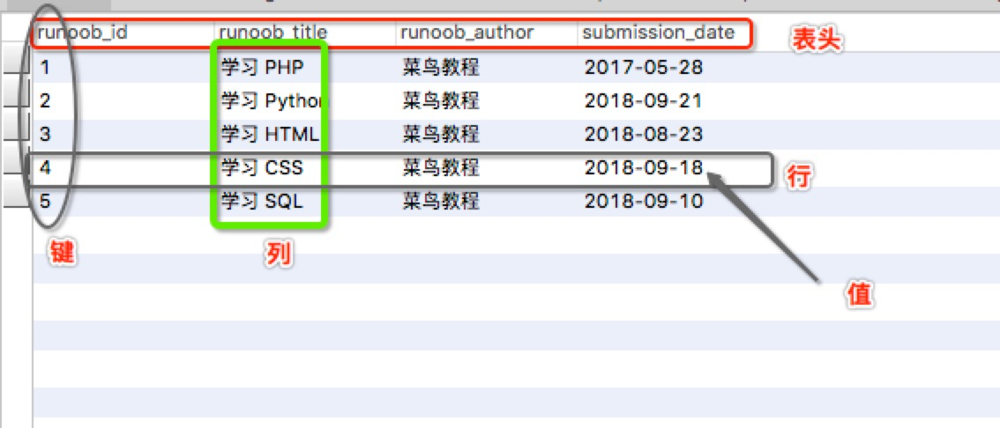
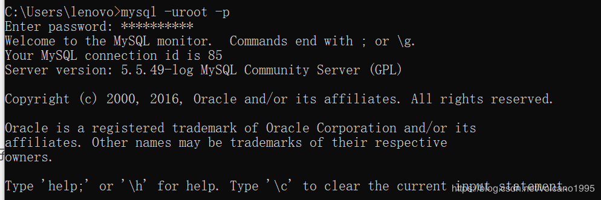
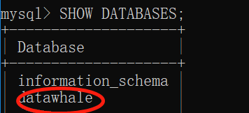
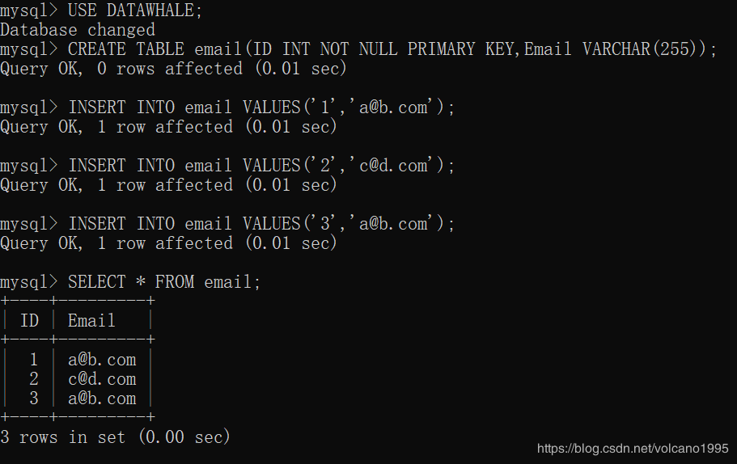
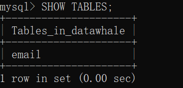
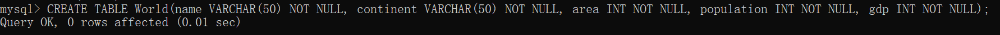
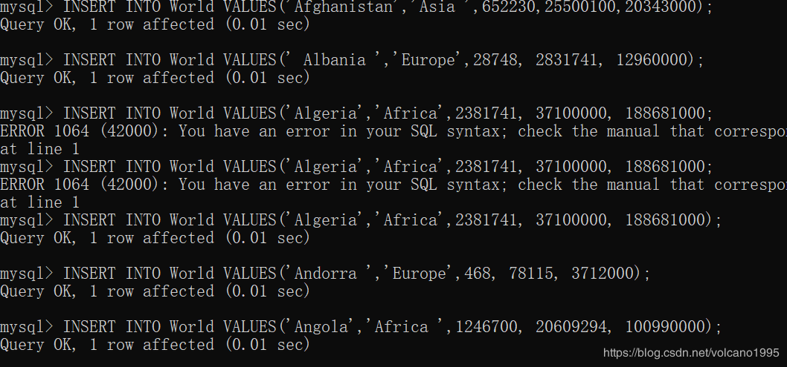
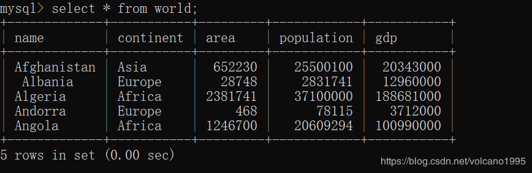
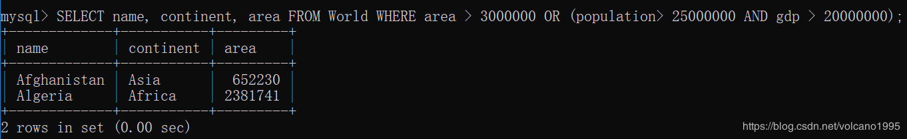

## Task 1(3天)
### 1.1 - MySQL 软件安装及数据库基础
学习内容：
1. 软件安装及服务器设置。http://www.runoob.com/mysql/mysql-install.html
2. 使用图形界面软件 Navicat for SQL
3. 数据库基础知识

    a. 数据库定义

    b. 关系型数据库

    c. 二维表

    d. 行

    e. 列

    f. 主键

    g. 外键

4. MySQL 数据库管理系统

    a. 数据库

    b. 数据表

    c. 视图

    d. 存储过程

* 参考资料

    + [SQL 必知必会] https://u18036366.pipipan.com/fs/18036366-300877816
    + [MySQL 教程] http://www.runoob.com/smysql/mysql-tutorial.html

* 额外的参考资料：

    + 虚拟机安装Linux https://blog.csdn.net/yang5726685/article/details/78635388
    + Windows 10下 MySQL https://cloud.tencent.com/developer/article/1010608
    + Windows 安装 MySQL 常见问题 https://blog.csdn.net/qq_40942329/article/details/79125366

### 1.2 - MySQL 基础 （一）查询语句
* 导入示例数据库，教程 https://www.yiibai.com/mysql/how-to-load-sample-database-into-mysql-database-server.html
* SQL 是什么？MySQL 是什么？
* 查询语句 SELECT FROM
    * 语句解释

    * 去重语句

    * 前 N 个语句

* 筛选语句 WHERE

    * 语句解释

    * 运算符

* 分组语句 GROUP BY

    * 语句解释

    * HAVING 子句

* 排序语句 ORDER BY

    * 语句解释

    * 正序、逆序

* SQL 注释

* SQL 代码规范

    * [SQL 编程格式的优化建议] https://zhuanlan.zhihu.com/p/27466166
    * [SQL Style Guide]https://www.sqlstyle.guide/


### 项目一：查找重复的电子邮箱（难度：简单）

创建 email 表，并插入如下三行数据

```SQL
+----+---------+
| Id | Email   |
+----+---------+
| 1  | a@b.com |
| 2  | c@d.com |
| 3  | a@b.com |
+----+---------+
```


编写一个 SQL 查询，查找 email 表中所有重复的电子邮箱。

根据以上输入你的查询应返回以下结果：

```SQL
+---------+
| Email   |
+---------+
| a@b.com |
+---------+
```

**说明**：所有电子邮箱都是小写字母。

### 项目二：查找大国（难度：简单）

创建如下 World 表

```SQL
+------------+----------+---------+--------------+---------------+
| name       | continent| area    | population   | gdp           |
+------------+----------+---------+--------------+---------------+
| Afghanistan| Asia     | 652230  | 25500100     | 20343000      |
| Albania    | Europe   | 28748   | 2831741      | 12960000      |
| Algeria    | Africa   | 2381741 | 37100000     | 188681000     |
| Andorra    | Europe   | 468     | 78115        | 3712000       |
| Angola     | Africa   | 1246700 | 20609294     | 100990000     |
+------------+----------+---------+--------------+---------------+
```

如果一个国家的面积超过 300 万平方公里，或者(人口超过 2500 万并且 gdp 超过 2000 万)，那么这个国家就是大国家。

编写一个 SQL 查询，输出表中所有大国家的名称、人口和面积。

例如，根据上表，我们应该输出:

```SQL
+--------------+-------------+--------------+
| name         | population  | area         |
+--------------+-------------+--------------+
| Afghanistan  | 25500100    | 652230       |
| Algeria      | 37100000    | 2381741      |
+--------------+-------------+--------------+
```

### 【任务说明】
1.1 是软件安装和配置，以及一些数据库理论知识储备。
学习内容是指需要在博客文章中总结的知识点，包括但不仅限于这些知识点。比如一些安装过程中的报错及解决办法也可以写。

1.2 是最最基础的查询语句，可以说学完其中内容，SQL 语句就掌握了 30% 了。
语言规范非常重要，请大家认真仔细阅读。请记住，你写 SQL 需要考虑别人 review 时的心情。写的过于杂乱会分分钟造成暴力事件。
学习内容中函数部分，是让大家了解下 MySQL 可以怎样处理一些数据。了解些常用的，等实际中遇到了再回头查找详细就行。
祝大家学习开心。:-)

考虑到本次集训有很多新手，本次作业赠送建表代码，意不意外，开不开心。
直接将以下 code 内容复制到 cmd 或者 navicat 运行就行。

#### 项目一

-- 创建表

```SQL
CREATE TABLE email (
ID INT NOT NULL PRIMARY KEY,
Email VARCHAR(255) NOT NULL
);
```

-- 插入数据

```SQL
INSERT INTO email VALUES('1','a@b.com');
INSERT INTO email VALUES('2','a@b.com');
INSERT INTO email VALUES('3','a@b.com');
```

#### 项目二

-- 创建表

```SQL
CREATE TABLE World (
name VARCHAR(50) NOT NULL,
continent VARCHAR(50) NOT NULL,
area INT NOT NULL,
population INT NOT NULL,
gdp INT NOT NULL
);
```

-- 插入数据

```SQL
INSERT INTO World
  VALUES('Afghanistan','Asia',652230,25500100,20343000);
INSERT INTO World
  VALUES('Albania','Europe',28748,2831741,12960000);
INSERT INTO World
  VALUES('Algeria','Africa',2381741,37100000,188681000);
INSERT INTO World
  VALUES('Andorra','Europe',468,78115,3712000);
INSERT INTO World
  VALUES('Angola','Africa',1246700,20609294,100990000);
```


==========================================================================
**以下为实战**


## 一、MySQL 软件安装及服务器设置
### 1. 软件安装及服务器设置

参考链接：[MySQL 安装](http://www.runoob.com/mysql/mysql-install.html)

### 2. 数据库基础知识

#### 2.1 数据库定义

数据库（Database）是按照数据结构来组织、存储和管理数据的仓库。

每个数据库都有一个或多个不同的 API 用于创建，访问，管理，搜索和复制所保存的数据。

我们也可以将数据存储在文件中，但是在文件中读写数据速度相对较慢。


#### 2.2关系型数据库（RDBMS）

所谓的关系型数据库，是建立在关系模型基础上的数据库，借助于集合代数等数学概念和方法来处理数据库中的数据。

RDBMS 即关系数据库管理系统(Relational Database Management System)的特点：

* 1.数据以表格的形式出现
* 2.每行为各种记录名称
* 3.每列为记录名称所对应的数据域
* 4.许多的行和列组成一张表单
* 5.若干的表单组成database

#### 2.3 术语

* **数据库**: 数据库是一些关联表的集合。
* **数据表**: 表是数据的矩阵。在一个数据库中的表看起来像一个简单的电子表格。
* **列**: 一列(数据元素) 包含了相同的数据, 例如邮政编码的数据。
* **行**：一行（=元组，或记录）是一组相关的数据，例如一条用户订阅的数据。
* **冗余**：存储两倍数据，冗余降低了性能，但提高了数据的安全性。
* **主键**：主键是唯一的。一个数据表中只能包含一个主键。你可以使用主键来查询数据。
* **外键**：外键用于关联两个表。
* **复合键**：复合键（组合键）将多个列作为一个索引键，一般用于复合索引。
* **索引**：使用索引可快速访问数据库表中的特定信息。索引是对数据库表中一列或多列的值进行排序的一种结构。类似于书籍的目录。
* **参照完整性**: 参照的完整性要求关系中不允许引用不存在的实体。与实体完整性是关系模型必须满足的完整性约束条件，目的是保证数据的一致性


### 3. MySQL数据库管理系统

#### 3.1 数据库

MySQL 为关系型数据库(Relational Database Management System), 这种所谓的"关系型"可以理解为"表格"的概念, 一个关系型数据库由一个或数个表格组成, 如图所示的一个表格:



* 表头(header): 每一列的名称;
* 列(col): 具有相同数据类型的数据的集合;
* 行(row): 每一行用来描述某条记录的具体信息;
* 值(value): 行的具体信息, 每个值必须与该列的数据类型相同;
* **键(key)**: 键的值在当前列中具有唯一性。

#### 3.2 视图

**定义**：

视图（view）是一种虚拟存在的表，是一个逻辑表，本身并不包含数据。作为一个select语句保存在数据字典中的。

通过视图，可以展现基表的部分数据；视图数据来自定义视图的查询中使用的表，使用视图动态生成。

**优点**：

1）简单：使用视图的用户完全不需要关心后面对应的表的结构、关联条件和筛选条件，对用户来说已经是过滤好的复合条件的结果集。

2）安全：使用视图的用户只能访问他们被允许查询的结果集，对表的权限管理并不能限制到某个行某个列，但是通过视图就可以简单的实现。

3）数据独立：一旦视图的结构确定了，可以屏蔽表结构变化对用户的影响，源表增加列对视图没有影响；源表修改列名，则可以通过修改视图来解决，不会造成对访问者的影响。

总而言之，使用视图的大部分情况是为了保障数据安全性，提高查询效率。


## 二、MySQL 基础 （一）查询语句

### 2.1 查询语句 SELECT FROM

**语法**

以下为在MySQL数据库中查询数据通用的 SELECT 语法：

```SQL
SELECT column_name,column_name
FROM table_name
[WHERE Clause]
[LIMIT N][ OFFSET M]
```

* 查询语句中你可以使用一个或者多个表，表之间使用逗号(,)分割，并使用WHERE语句来设定查询条件。

* SELECT 命令可以读取一条或者多条记录。

* 你可以使用星号（\*）来代替其他字段，SELECT语句会返回表的所有字段数据
* 你可以使用 WHERE 语句来包含任何条件。
* 你可以使用 LIMIT 属性来设定返回的记录数。
* 你可以通过OFFSET指定SELECT语句开始查询的数据偏移量。默认情况下偏移量为0。

### 2.2 筛选语句 WHERE

**语法**

以下是 SQL SELECT 语句使用 WHERE 子句从数据表中读取数据的通用语法：

```SQL
SELECT field1, field2,...fieldN FROM table_name1, table_name2...
[WHERE condition1 [AND [OR]] condition2.....
```

* 查询语句中你可以使用一个或者多个表，表之间使用逗号, 分割，并使用WHERE语句来设定查询条件。
* 你可以在 WHERE 子句中指定任何条件。
* 你可以使用 AND 或者 OR 指定一个或多个条件。
* WHERE 子句也可以运用于 SQL 的 DELETE 或者 UPDATE 命令。
* WHERE 子句类似于程序语言中的 if 条件，根据 MySQL 表中的字段值来读取指定的数据。

### 2.3 排序语句 ORDER BY

**语法**

以下是 SQL SELECT 语句使用 ORDER BY 子句将查询数据排序后再返回数据：

```SQL
SELECT field1, field2,...fieldN table_name1, table_name2...
ORDER BY field1, [field2...] [ASC [DESC]]
```

* 你可以使用任何字段来作为排序的条件，从而返回排序后的查询结果。
* 你可以设定多个字段来排序。
* 你可以使用 ASC 或 DESC 关键字来设置查询结果是按升序或降序排列。 默认情况下，它是按升序排列。
* 你可以添加 WHERE...LIKE 子句来设置条件。

### 2.4 分组语句 GROUP BY​​

**GROUP BY 语法**

```SQL
SELECT column_name, function(column_name)
FROM table_name
WHERE column_name operator value
GROUP BY column_name;
```

### 2.5 SQL注释

### 2.6 SQL代码规范

[SQL编程格式的优化建议](https://zhuanlan.zhihu.com/p/27466166)

[SQL Style Guide](https://www.sqlstyle.guide/)


## 三、MySQL实战

### 项目一：查找重复的电子邮箱（难度：简单）

1. 输入mysql -uroot -p回车，输入密码，成功登录数据库：



2. 创建名为Datawhale的数据库：


3. 显示目前创建的数据库：



4. 使用以下命令选择该数据库

```sql
USE DATAWHALE;
```

5. 使用以下命令在里面创建email表

```SQL
CREATE TABLE email(ID INT NOT NULL PRIMARY KEY,Email VARCHAR(255));
```

6. 使用以下命令在里面插入数据

```SQL
INSERT INTO email VALUES('1','a@b.com');

INSERT INTO email VALUES('2','c@d.com');

INSERT INTO email VALUES('3','a@b.com');
```

7. 使用以下命令显示表中数据

```SQL
SELECT * FROM email;
```





8. 查找 Person 表中所有重复的电子邮箱


### 项目二：超过5名学生的课（难度：简单）

1. 创建World表



2. 插入数据



3. 显示表中的所有数据



4. SQL查询，输出表中所有大国家的名称、人口和面积




end of this page
