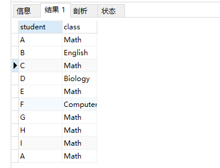
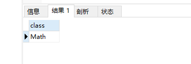
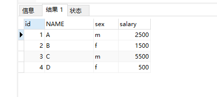
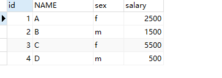
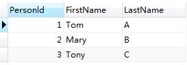
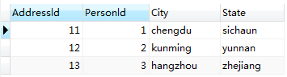
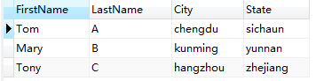
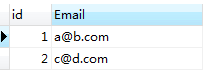

## 任务3打卡
###任务二

### 2.1 MySQL 基础 （二）- 表操作
#### 学习内容
1. MySQL表数据类型

2. 用SQL语句创建表

    语句解释

    设定列类型 、大小、约束

    设定主键

3. 用SQL语句向表中添加数据

    语句解释

    多种添加方式（指定列名；不指定列名）

4. 用SQL语句删除表

    语句解释

    DELETE

    DROP

    TRUNCATE

    不同方式的区别

5. 用SQL语句修改表

    修改列名

    修改表中数据

    删除行

    删除列

    新建列

    新建行


##### 作业
创建如下所示的 courses 表 ，有: student (学生) 和 class (课程)。

例如,表:
```SQL
+---------+------------+
| student | class      |
+---------+------------+
| A       | Math       |
| B       | English    |
| C       | Math       |
| D       | Biology    |
| E       | Math       |
| F       | Computer   |
| G       | Math       |
| H       | Math       |
| I       | Math       |
| A       | Math        |
+---------+------------+
```

编写一个 SQL 查询，列出所有超过或等于5名学生的课。

应该输出:

```SQL
+---------+
| class   |
+---------+
| Math    |
+---------+
```

Note:
学生在每个课中不应被重复计算。


#### 项目四：交换工资（难度：简单）

创建一个 salary 表，如下所示，有m=男性 和 f=女性的值 。

例如:

```SQL
| id | name | sex | salary |
|----|------|-----|--------|
| 1  | A    | m   | 2500   |
| 2  | B    | f   | 1500   |
| 3  | C    | m   | 5500   |
| 4  | D    | f   | 500    |
```

交换所有的 f 和 m 值(例如，将所有 f 值更改为 m，反之亦然)。要求使用一个更新查询，并且没有中间临时表。

运行你所编写的查询语句之后，将会得到以下表:

```SQL
| id | name | sex | salary |
|----|------|-----|--------|
| 1  | A    | f  | 2500   |
| 2  | B    | m   | 1500   |
| 3  | C    | f   | 5500   |
| 4  | D    | m   | 500    |
```

### 2.2 MySQL 基础 （三）- 表联结
#### 学习内容
* MySQL别名

* INNER JOIN

* LEFT JOIN

* CROSS JOIN

* 自连接

* UNION

* 以上几种方式的区别和联系

#### 作业

#### 项目五：组合两张表 （难度：简单）

在数据库中创建表1和表2，并各插入三行数据（自己造）

表1: Person

```SQL
+-------------+---------+
| 列名         | 类型     |
+-------------+---------+
| PersonId    | int     |
| FirstName   | varchar |
| LastName    | varchar |
+-------------+---------+
```

PersonId 是上表主键

表2: Address

```SQL
+-------------+---------+
| 列名         | 类型    |
+-------------+---------+t
| AddressId   | int     |
| PersonId    | int     |
| City        | varchar |
| State       | varchar |
+-------------+---------+
```

AddressId 是上表主键

编写一个 SQL 查询，满足条件：无论 person 是否有地址信息，都需要基于上述两表提供 person 的以下信息：FirstName, LastName, City, State

#### 项目六：删除重复的邮箱（难度：简单）

编写一个 SQL 查询，来删除 email 表中所有重复的电子邮箱，重复的邮箱里只保留 Id 最小 的那个。

```SQL
+----+---------+
| Id | Email   |
+----+---------+
| 1  | a@b.com |
| 2  | c@d.com |
| 3  | a@b.com |
+----+---------+
```

Id 是这个表的主键。

例如，在运行你的查询语句之后，上面的 Person 表应返回以下几行:

```SQL
+----+------------------+
| Id | Email            |
+----+------------------+
| 1  | a@b.com |
| 2  | c@d.com  |
+----+------------------+
```

#### 【任务说明】
本次作业以及之后的都需要小伙伴自己创建表和插入数据啦。就当表操作的练习。请注意语句规范，可参考上次作业的参考答案。
表联结是SQL语句核心部分。因为在正式业务中必然会涉及到多表之间的数据调用。所以大家务必完全理解吃透这部分的内容。
祝大家学习开心。

=================================================================================

以下是实战

#### 项目三：

1. 创建表 courses

```SQL
#创建courses
CREATE TABLE courses ( student VARCHAR ( 10 ) NOT NULL, class VARCHAR ( 10 ) NOT NULL )
```

2. 插入数据

```SQL
INSERT INTO courses
VALUES
	( "A", "Math" ),
	( "B", "English" ),
	( "C", "Math" ),
	( "D", "Biology" ),
	( "E", "Math" ),
	( "F", "Computer" ),
	( "G", "Math" ),
	( "H", "Math" ),
	( "I", "Math" ),
	( "A", "Math" );
```

3. 建表结果



4. 编写一个 SQL 查询，列出所有超过或等于5名学生的课

```SQL
SELECT class FROM courses GROUP BY(class) HAVING COUNT(student)>=5;
```




#### 项目四

1. 建表并插入数据

```SQL
CREATE TABLE salary(
    id     int,
	name   VARCHAR(225),
	sex    VARCHAR(225),
	salary int
 );
 INSERT INTO salary (id, name, sex, salary)
 VALUES ('1', 'A', 'm', '2500'),
        ('2', 'B', 'f', '1500'),
		('3', 'C', 'm', '5500'),
		('4', 'D', 'f', '500')；
SELECT * FROM salary;
```

2. 结果显示如下



3. 更新数据

```SQL
UPDATE salary
SET sex = IF(sex='f','m','f')
SELECT * FROM salary;
```




#### 项目五：组合两张表
1. 创建两表

```SQL
CREATE TABLE Person(
     Personld  INT PRIMARY KEY,
	 FirstName VARCHAR(225),
	 LastName  VARCHAR(225)
 );
 INSERT INTO Person(Personld, Firstname, Lastname)
 VALUES ('1', 'Tom', 'A'),
        ('2', 'Mary', 'B'),
		('3', 'Tony', 'C');
 CREATE TABLE Address(
     Addressld INT PRIMARY KEY,
	 Personld  INT,
	 City      VARCHAR(225),
	 State     VARCHAR(225)
 );
 INSERT INTO Address(Addressld, Personld, City, State)
 VALUES ('11', '1', 'chengdu', 'sichaun'),
        ('12', '2', 'kunming', 'yunnan'),
		('13', '3', 'hangzhou', 'zhejiang');
```

2. 结果如下





3. 连接两表
```SQL
SELECT
         FirstName,
		 LastName,
		 City,
		 State
FROM
        Person t1
        INNER JOIN
	    Address t2 ON t1.Personld = t2.Personld;
```

4. 结果如下




#### 项目六：删除重复的邮箱

1. 删除重复的邮箱

```SQL
CREATE TABLE email(
     id INT PRIMARY KEY,
	 Email  VARCHAR(225)
 );
INSERT INTO email(id, email)
VALUES
      ('1', 'a@b.com'),
      ('2', 'c@d.com'),
	  ('3', 'a@b.com');
DELETE e2
FROM email e1
         INNER JOIN
	 email e2 ON e2.Email = e1.Email
WHERE e1.id < e2.id;
SELECT * FROM email;
```

2. 结果如下




end of this page
